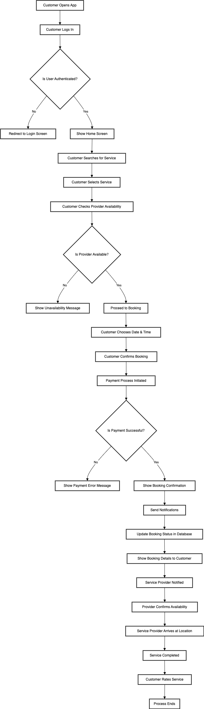

Creating a mobile app to bring all workers and home owners under one platform. Please check the below features.

## Define the Scope and Features
- User Profiles: Separate profiles for service providers (workers) and customers (homeowners).
- Service Listings: Categories for various services (plumbing, cleaning, electrical, etc.).
- Search & Filters: Users can search for services and filter results by location, price, ratings, etc.
- Booking System: Allow customers to book services at their convenience.
- Payment Gateway: Secure online payment integration (credit/debit cards, wallets, UPI, etc.).
- Ratings & Reviews: Customers can leave feedback and rate the service providers.
- Chat/Communication: In-app messaging or calling feature for customers and service providers.
- Notifications: Alerts for booking confirmations, reminders, promotions, etc.
- GPS & Location Services: Real-time location tracking of service providers.
- Admin Panel: For managing users, services, payments, and overall app monitoring.

## Technology Stack Suggestions:
- Frontend: React Native, Flutter, or Swift (iOS), Kotlin/Java (Android)
- Backend: Node.js with Express, Django, or Ruby on Rails
- Database: MySQL, PostgreSQL, or MongoDB
- Payment Gateway: Stripe, PayPal, Razorpay
- Cloud Services: AWS, Google Cloud, or Azure

## Backlog
### High Priority
These features are essential for enhancing user experience and driving engagement. They provide significant value with relatively low to moderate implementation complexity.
1. **Service Provider Availability Scheduling**
- Impact: High (Improves booking efficiency, reduces conflicts)
- Effort: Moderate
- Reason: Ensures that users can book services when providers are available, reducing frustration and improving the overall booking experience.

2. **In-App Wallet**
- Impact: High (Streamlines payments, encourages repeat usage)
- Effort: Moderate to High
- Reason: Simplifies payment processing and offers a convenient way to manage transactions, fostering loyalty through potential cashback or rewards.

3. **Loyalty Program**
- Impact: High (Increases customer retention)
- Effort: Moderate
- Reason: Encourages repeat bookings and boosts customer loyalty, which is crucial for the long-term success of the app.

4. **Referral Program**
- Impact: High (User acquisition, organic growth)
- Effort: Low to Moderate
- Reason: Drives new user acquisition at a low cost, leveraging existing users to bring in more customers.

### Medium Priority
These features enhance the app's functionality and user experience but can be developed after the high-priority items.

1. **Ratings & Certifications for Service Providers**
- Impact: Moderate (Builds trust, improves decision-making)
- Effort: Moderate
- Reason: Helps customers make informed choices and motivates providers to maintain high standards.

2. **Service Bundles and Offers**
- Impact: Moderate (Increases average transaction value)
- Effort: Moderate
- Reason: Encourages users to purchase multiple services, boosting revenue.

3. **Multi-Language Support**
- Impact: Moderate (Increases accessibility)
- Effort: Moderate
- Reason: Expands the user base by catering to non-English speakers, enhancing user inclusivity.

4. **Service History & Rebooking**
- Impact: Moderate (Convenience, user retention)
- Effort: Low to Moderate
- Reason: Simplifies the rebooking process, especially for frequent users, leading to higher engagement.

5. **Advanced Analytics for Service Providers**
- Impact: Moderate (Provider satisfaction, service quality)
- Effort: Moderate to High
- Reason: Gives service providers valuable insights to improve their services, leading to better overall user satisfaction.

### Low Priority
These features are more specialized or advanced and can be considered for future iterations of the app once the core functionality is robust.

1. **Video Consultation**
- Impact: Moderate (Enhances communication, especially for complex services)
- Effort: High
- Reason: While valuable, this feature may be more relevant to niche services and requires significant development effort.

2. **Dynamic Pricing**
- Impact: Moderate (Maximizes revenue)
- Effort: High
- Reason: Useful for peak times but complex to implement and might be confusing for users if not done carefully.

3. **Task Tracking and Reporting**
- Impact: Moderate (Transparency, user satisfaction)
- Effort: Moderate to High
- Reason: Adds value for customers tracking long-term or complex projects, but it’s less critical for simple or one-time services.

4. **Emergency Services**
- Impact: Moderate (Addresses urgent needs)
- Effort: Moderate
- Reason: Useful for certain service types, but may not be necessary for all users or services.

5. **Customer Support Integration**
- Impact: Moderate (Improves user support)
- Effort: Moderate
- Reason: While important, this feature can be implemented with simpler methods initially (e.g., email support) and expanded later.

6. **Custom Service Requests**
- Impact: Low to Moderate (Flexibility for users)
- Effort: Moderate
- Reason: Offers flexibility for unique needs but may require significant backend adjustments and manual handling initially.

## Process flowcart


## Process flow

## Folder Structure

```bash
/mrfixo
│
├── /backend
│   ├── /controllers
│   │   └── translateController.js
│   ├── /models
│   │   └── (if needed, add your Mongoose models here)
│   ├── /routes
│   │   └── translateRoutes.js
│   ├── /utils
│   │   ├── errorHandler.js
│   │   ├── logger.js
│   │   ├── translateService.js
│   │   └── validators.js
│   ├── .env
│   ├── server.js
│   ├── package.json
│   └── README.md
│
├── /frontend
│   ├── /assets
│   │   └── (images, fonts, etc.)
│   ├── /components
│   │   └── (reusable UI components)
│   ├── /navigation
│   │   └── (React Navigation setup)
│   ├── /screens
│   │   └── TranslateScreen.js
│   ├── /services
│   │   ├── api.js
│   │   └── translateService.js
│   ├── /utils
│   │   └── errorHandler.js
│   ├── /App.js
│   ├── package.json
│   ├── babel.config.js
│   └── README.md
│
├── .gitignore
├── README.md
└── LICENSE (if needed)
```

## Details of Each Directory

### Backend
- `/controllers`: Contains your controller files, which handle incoming HTTP requests and business logic.
- `/models`: Contains Mongoose models if you are using MongoDB or any other ORM models.
- `/routes`: Contains the route definitions that map URL paths to controller actions.
- `/utils`: Utility functions such as error handling, logging, and translation service.
- `.env`: Environment variables for your backend, such as API keys, database connection strings, etc.
- `server.js`: Entry point of your Node.js application.
- `package.json`: Lists backend dependencies and scripts.

### Frontend
- `/assets`: Contains static assets like images and fonts.
- `/components`: Reusable UI components that can be used across multiple screens.
- `/navigation`: Navigation configuration using React Navigation.
- `/screens`: Individual screen components, each representing a different part of the UI.
- `/services`: Contains services for making API calls and interacting with the backend.
- `/utils`: Utility functions, such as error handling and validation.
- `App.js`: Entry point of the React Native app.
- `babel.config.js`: Babel configuration for React Native.
- `package.json`: Lists frontend dependencies and scripts.

### Root Directory
- `.gitignore`: Specifies files and directories to be ignored by Git.
- `README.md`: General information about the project, how to set it up, and how to contribute.
- `LICENSE`: (Optional) If you plan to open-source the project, specify the license type here.